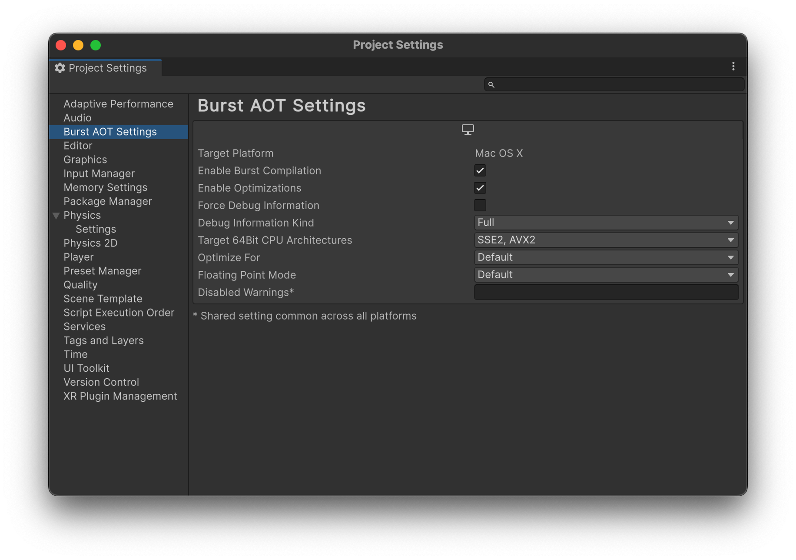

# Burst AOT Settings reference

To control Burst's AOT compilation, use the **Burst AOT Settings** section of the [Project Settings window](xref:um-comp-manager-group) (**Edit &gt; Project Settings &gt; Burst AOT Settings**). These settings control Burst compilation in Player builds only. To configure Burst compilation in the Unity Editor, refer to [Burst menu reference](editor-burst-menu.md).



|**Setting**|**Function**|
|---|---|
|**Target Platform**| Displays the current platform. To change the platform:<br/><br/>&#8226; For Editor versions 6 and later, go to **File &gt; Build Profiles**<br/>&#8226; For Editor versions earlier than 6, go to **File &gt; Build Settings**.<br/><br/>You can define different Burst AOT settings for each platform.|
|**Enable Burst Compilation**| Enable this setting to turn Burst compilation on. Disable this setting to deactivate Burst compilation for the selected platform.|
|**Enable Optimizations**| Enable this setting to activate Burst optimizations.|
|**Force Debug Information**| Enable this setting to make Burst generate debug information. This adds debug symbols to your project, even in release builds of your project, so that when you load it in a debugger you can see file and line information.|
|**Use Platform SDK Linker**<br/>(Windows, macOS, and Linux builds only)| Disables cross compilation support. When you enable this setting, you must use platform-specific tools for your target platform. Only enable this setting for debugging purposes. For more information, refer to [Platforms with cross compilation disabled](building-projects.md#cross-compilation).|
|**Target 32Bit CPU Architectures**<br/>(Displayed if the architecture is supported)| Select the CPU architectures that you want to use for 32 bit builds. By default, SSE2 and SSE4 are selected.|
|**Target 64Bit CPU Architectures**<br/>(Displayed if the architecture is supported)| Select the CPU architectures that you want to use for 64-bit builds. By default, SSE2 and SSE4 are selected.|
|**Target Arm 64Bit CPU Architectures**<br/>(Displayed if the architecture is supported)| Select the CPU architectures that you want to use for Arm 64-bit builds. By default, ARMV8A is selected.|
|**Optimize For**| Select which optimization settings to compile Burst code for. For more information see [`OptimizeFor`](xref:Unity.Burst.OptimizeFor).|
|Performance|Optimizes the job to run as fast as possible.|
|Size|Optimizes to make the code generation as small as possible.|
|Fast Compilation|Compiles code as fast as possible, with minimal optimization. Burst doesn't perform any  vectorization, inlining, or loop optimizations. |
|Balanced</br>(Default)|Optimizes for code that runs fast but keeps compile time as low as possible.|
|**Floating Point Mode**| Select the default floating point mode to use for Burst compiled code. This may be overridden by specifying the `FloatMode` field for `BurstCompile` attribute or a job. For more information see [`FloatMode`](xref:Unity.Burst.FloatMode).  |
|**Disabled Warnings**| Specify a semi-colon separated list of Burst warning numbers to disable the warnings for a player build. Unity shares this setting across all platforms. This can be useful if you want to ignore specific [compilation warnings](compilation-warnings.md) while testing your application. |
|**Stack Protector**<br/>(Displayed if the architecture is supported)| Select the stack protector level. |
|**Stack Protector Buffer Size**<br/>(Displayed if the architecture is supported)| The stack protector buffer size threshold. |

The **CPU Architecture** setting is only supported for Windows, macOS, Linux and Android. Unity builds a Player that supports the CPU architectures you've selected. Burst generates a special dispatch into the module, so that the code generated detects the CPU the target platform uses and selects the appropriate CPU architecture at runtime.

## The Stack Protector Settings

The Stack Protector option governs whether stack protectors are applied. Functions with stack protectors have a "canary" value added to the stack frame, which is then verified upon the function's return. The idea is that a buffer overflow would alter the canary value before reaching the return address, helping to detect and prevent exploitation.

When **Off** is selected, no stack protectors are emitted.  

The values **Basic**, **Strong** and **All** differ in what heuristic is used to determine for which functions stack protectors are generated. These options correspond to `clang`'s options `--fstack-protector`, `--fstack-protector-strong` and `--fstack-protector-all`, respectively. 

The Stack Protector Buffer Size is a threshold value used by the heuristics both to determine if a function is considered vulnerable and to guide layout of the arrays and structures on the stack.

## Optimize For setting

>[!NOTE]
>Any [OptimizeFor](xref:Unity.Burst.OptimizeFor) setting is the global default optimization setting for any Burst job or function-pointer. If any assembly level `BurstCompile`, or a specific Burst job or function-pointer has an `OptimizeFor` setting, it overrides the global optimization setting for those jobs.

To control how Burst optimizes your code, use the **Optimize For** setting in the Editor, or use the [`OptimizeFor`](xref:Unity.Burst.OptimizeFor) field:

```c#
[BurstCompile(OptimizeFor = OptimizeFor.FastCompilation)]
public struct MyJob : IJob
{
    // ...
}
```

## Additional resources

* [Building your project](building-projects.md)
* [Editor reference](editor-reference-overview.md)
* [Project Settings](xref:um-comp-manager-group)
