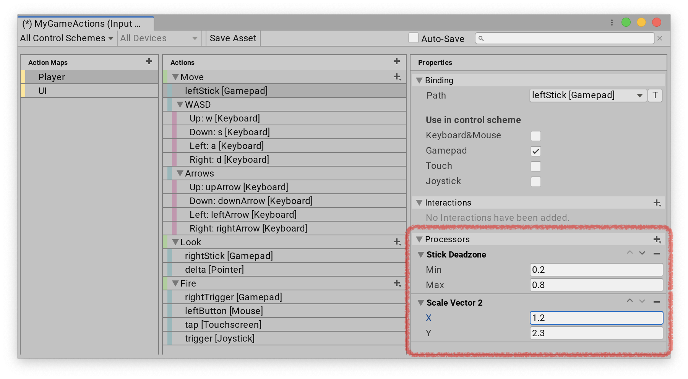

# Apply Processors

The following are the three different ways of applying Processors to input events. For more information on the general usage of Processors, refer to [Using Processors](UsingProcessors.md).

* [Processors on Bindings](#processors-on-bindings)
* [Processors on Actions](#processors-on-actions)
* [Processors on Controls](#processors-on-controls)

## Processors on Bindings

When you create Bindings for your [actions](Actions.md), you can choose to add Processors to the Bindings. These process the values from the controls they bind to, before the system applies them to the Action value. For instance, you might want to invert the `Vector2` values from the controls along the Y-axis before passing these values to the Action that drives the input logic for your application. To do this, you can add an [Invert Vector2](ProcessorTypes.md#invert-vector-2) Processor to your Binding.

If you're using Actions defined in the [Input Actions Editor](ActionsEditor.md), or in an [Action Asset](ActionAssets.md), you can add any Processor to your Bindings in the Input Action editor:

1. Select the Binding you want to add Processors to so that the Binding Properties panel shows up on the right side.
2. Select the **Add (+)** icon on the __Processors__ foldout to open a list of all available Processors that match your control type.
3. Choose a Processor type to add a Processor instance of that type. The Processor now appears under the __Processors__ foldout.
4. (Optional) If the Processor has any parameters, you can edit them in the __Processors__ foldout.



To remove a Processor, click the Remove (-) icon next to it. You can also use the up and down arrows to change the order of Processors. This affects the order in which the system processes values.

If you create your Bindings in code, you can add Processors like this:

```CSharp
var action = new InputAction();
action.AddBinding("<Gamepad>/leftStick")
    .WithProcessor("invertVector2(invertX=false)");
```

## Processors on Actions

Processors on Actions work in the same way as Processors on Bindings, but they affect all controls bound to an Action, rather than just the controls from a specific Binding. If there are Processors on both the Binding and the Action, the system processes the ones from the Binding first.

You can add and edit Processors on Actions in the [Input Actions Editor](ActionsEditor.md), or in an  [Action Asset](ActionAssets.md) the [same way](#processors-on-bindings) as you would for Bindings: select an Action to edit, then add one or more Processors in the right window pane.

If you create your Actions in code, you can add Processors like this:

```CSharp
var action = new InputAction(processors: "invertVector2(invertX=false)");
```

## Processors on Controls

You can have any number of Processors directly on an [`InputControl`](../api/UnityEngine.InputSystem.InputControl.html), which then process the values read from the Control. Whenever you call [`ReadValue`](../api/UnityEngine.InputSystem.InputControl-1.html#UnityEngine_InputSystem_InputControl_1_ReadValue) on a Control, all Processors on that Control process the value before it gets returned to you. You can use [`ReadUnprocessedValue`](../api/UnityEngine.InputSystem.InputControl-1.html#UnityEngine_InputSystem_InputControl_1_ReadUnprocessedValue) on a Control to bypass the Processors.

The Input System adds Processors to a Control during device creation, if they're specified in the Control's [layout](Layouts.md). You can't add Processors to existing Controls after they've been created, so you can only add Processors to Controls when you're [creating custom devices](Devices.md#creating-custom-devices). The devices that the Input System supports out of the box already have some useful Processors added on their Controls. For instance, sticks on gamepads have a [Stick Deadzone](ProcessorTypes.md#stick-deadzone) Processor.

If you're using a layout generated by the Input System from a [state struct](Devices.md#step-1-the-state-struct) using [`InputControlAttributes`](../api/UnityEngine.InputSystem.Layouts.InputControlAttribute.html), you can specify the Processors you want to use via the [`processors`](../api/UnityEngine.InputSystem.Layouts.InputControlAttribute.html#UnityEngine_InputSystem_Layouts_InputControlAttribute_processors) property of the attribute, like this:

```CSharp
public struct MyDeviceState : IInputStateTypeInfo
{
    public FourCC format => return new FourCC('M', 'Y', 'D', 'V');

    // Add an axis deadzone to the Control to ignore values
    // smaller then 0.2, as our Control does not have a stable
    // resting position.
    [InputControl(layout = "Axis", processors = "AxisDeadzone(min=0.2)")]
    public short axis;
}
```

If you [create a layout from JSON](Layouts.md#layout-from-json), you can specify Processors on your Controls like this:

```CSharp
{
    "name" : "MyDevice",
    "extend" : "Gamepad", // Or some other thing
    "controls" : [
        {
            "name" : "axis",
            "layout" : "Axis",
            "offset" : 4,
            "format" : "FLT",
            "processors" : "AxisDeadzone(min=0.2)"
        }
    ]
}
```
